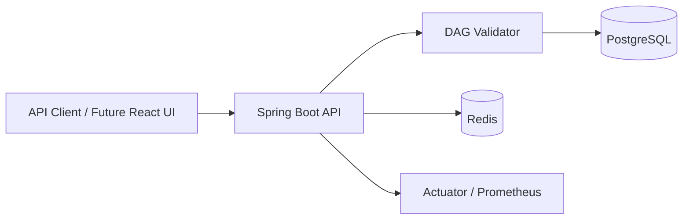
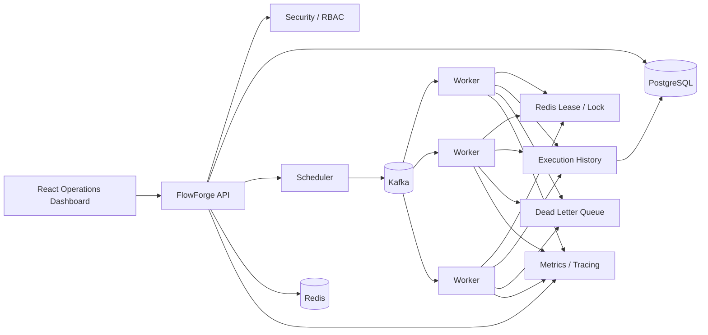

# FlowForge architecture

## Day 1 architecture

## Target architecture

## Reliability principles

1. Persist state before dispatching asynchronous work.
2. Treat worker delivery as at-least-once.
3. Make execution idempotent.
4. Use leases with expirations rather than permanent locks.
5. Model retry/backoff explicitly.
6. Preserve execution history for debugging.
7. Expose health and metrics by default.
